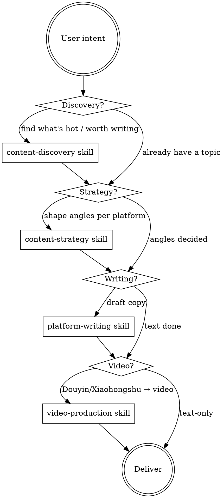

# Using Media-Pilot

Media-pilot turns ideas, links, or trending topics into ready-to-publish self-media content across Chinese platforms (WeChat, Xiaohongshu, Douyin, Bilibili). It can also proactively surface what's worth writing about.

<EXTREMELY-IMPORTANT>
If the user is doing ANY of the following, you MUST use media-pilot skills rather than answering from scratch:

- Writing an article, post, script, or caption
- Asking what to write about / what's trending / what's hot
- Sharing a URL they want to turn into content
- Mentioning 自媒体, 公众号, 小红书, 抖音, B站, or content creation
- Wanting a video made from text/an article
- Asking you to research a topic for content purposes

Even a 10% chance the work is content-related means invoke the relevant skill first. When in doubt, invoke. This is not optional.
</EXTREMELY-IMPORTANT>

## The Pipeline

Media-pilot has four stages. Most requests map onto one or more of them:

## How to Decide Which Skill to Use

| User says / situation | Skill to invoke |
|----------------------|-----------------|
| "最近有什么热点" / "帮我找找选题" / "有什么值得写的" / "what's trending" | `content-discovery` |
| Gives a topic and wants to write about it | `content-strategy` (then `platform-writing`) |
| "帮我写篇公众号文章" / "写个小红书文案" | `platform-writing` |
| "把这个文章做成视频" / "生成口播视频" | `video-production` |
| Shares a URL: "帮我把这个转成..." | Read it, then `content-strategy` → `platform-writing` |
| "一键帮我搞定" / wants the full flow | Run all stages in order |

## Full Automated Flow

When the user wants the complete pipeline (e.g. "帮我围绕 AI 编程写一套内容" or "一键全自动"):

1. **Discovery** — invoke `content-discovery` to find trending angles and reference material on the topic
2. **Strategy** — invoke `content-strategy` to pick angles and structure per platform
3. **Writing** — invoke `platform-writing` for each target platform (can be done in parallel)
4. **Video** — invoke `video-production` for platforms that need video (Douyin, Xiaohongshu)

Save all outputs under one working directory so the user can find everything. Use `content/<YYYY-MM-DD-topic-slug>/` relative to the workspace root (e.g. `content/2026-06-13-claude-4.6/`). The **discovery stage creates this folder**; every later stage reuses the same folder so nothing gets scattered. Run the pipeline from the workspace root so these paths resolve correctly.

## Skill Priority

1. **Discovery skills first** when the user has a topic but no direction
2. **Strategy next** to shape the angle
3. **Writing** to produce drafts
4. **Video production** last (depends on finished copy)

## What Media-Pilot Is NOT

- It does NOT auto-publish to platforms (no account integration). It produces ready-to-post files; the user does the final publishing.
- It does NOT fabricate trending data. Discovery uses real web search; if search is unavailable, say so rather than inventing trends.
- It does NOT override the user's platform choice. If they say "just WeChat", only produce WeChat copy.

## Reminders

- Always ask which platforms the user targets if unclear — copy style differs sharply between WeChat (formal/long) and Xiaohongshu (casual/emoji-heavy).
- For tech topics, discovery should pull from international sources (HN, AI lab blogs, Twitter) — see `content-discovery` references.
- Keep drafts in clear files (`wechat.md`, `xiaohongshu.md`, `douyin-script.md`, `bilibili.md`, `video.mp4`) so nothing gets lost.
